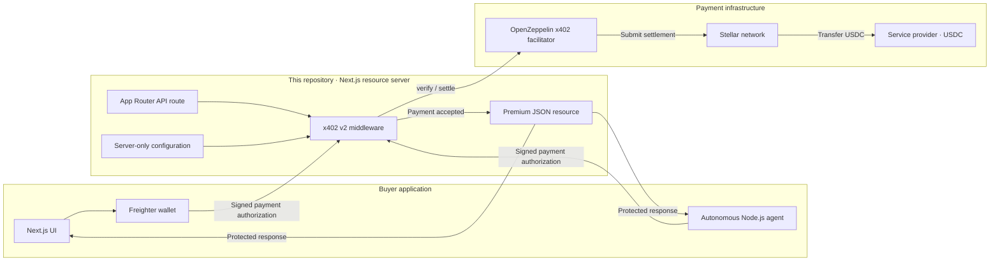
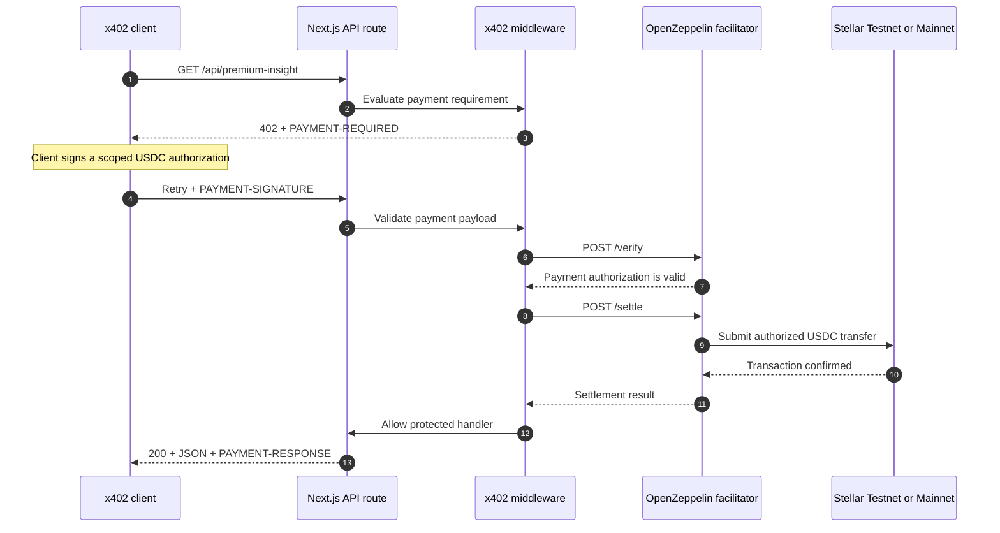
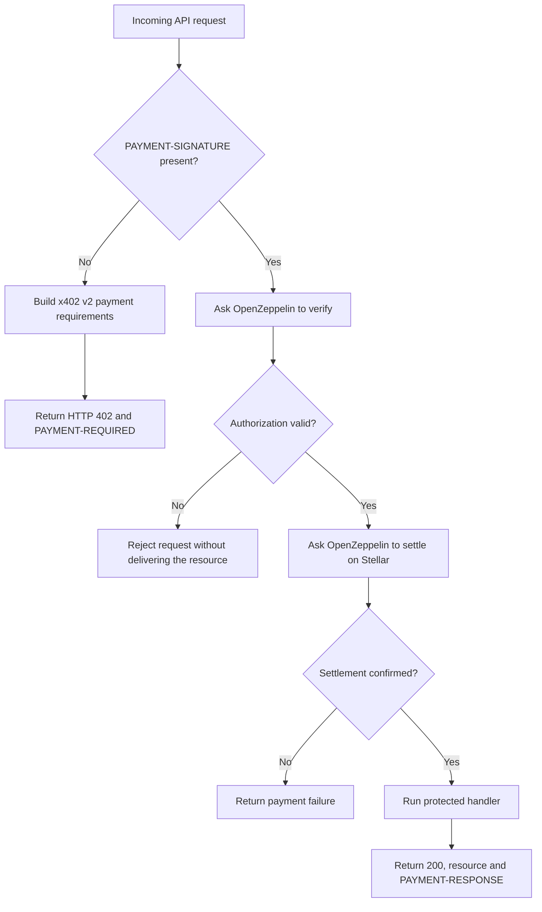

# Stellar x402 Workshop Server

A clone-friendly paid API built with Next.js App Router, TypeScript, x402 v2,
Stellar USDC, and the OpenZeppelin hosted facilitator.

## Solution architecture

This repository is the **resource server**. It publishes the paid API, defines
the price and recipient, and delegates payment verification and settlement to
the OpenZeppelin facilitator. The buyer lives in the separate workshop client
repository.



The API key used to call OpenZeppelin stays inside the resource server. The
server never receives the buyer's private key; it receives only a scoped,
signed authorization.

## Server request process



### Server responsibilities



## What students build

`GET /api/premium-insight` costs **$0.001 USDC**. Without payment it returns
`402 Payment Required`; an x402 client signs a scoped Stellar authorization and
retries; OpenZeppelin verifies and settles it; the server returns the JSON.

## Requirements

- Node.js 22+
- A public Stellar address that can receive USDC
- OpenZeppelin facilitator API key

## Testnet setup

1. Generate an API key at https://channels.openzeppelin.com/testnet/gen
2. Copy `.env.example` to `.env.local`.
3. Set `PAY_TO` and `OPENZEPPELIN_API_KEY`.
4. Run:

```bash
npm ci
npm run dev
```

The server starts at http://localhost:3000. The separate client defaults to
http://localhost:3001.

## Test the paywall

```bash
curl -i http://localhost:3000/api/premium-insight
```

Expected: status `402` and a `PAYMENT-REQUIRED` response header.

## Mainnet configuration

The code supports Mainnet, but the workshop intentionally executes payments on
Testnet. For Mainnet, generate a key at https://channels.openzeppelin.com/gen
and switch these values together:

```dotenv
STELLAR_NETWORK=stellar:pubnet
FACILITATOR_URL=https://channels.openzeppelin.com/x402
USDC_CONTRACT=CCW67TSZV3SSS2HXMBQ5JFGCKJNXKZM7UQUWUZPUTHXSTZLEO7SJMI75
PAY_TO=G_YOUR_MAINNET_RECEIVER
OPENZEPPELIN_API_KEY=your_mainnet_key
```

Never reuse Testnet keys or addresses blindly on Mainnet. Never expose the API
key through a `NEXT_PUBLIC_` variable.

## Vercel

Import this repository in Vercel and configure the same server-side variables.
Set `CLIENT_ORIGIN` to the deployed client URL. No custom server is required.

## Validation

```bash
npm run check
```

## Official references

- https://developers.stellar.org/docs/build/agentic-payments/x402
- https://developers.stellar.org/docs/build/agentic-payments/x402/built-on-stellar
- https://docs.openzeppelin.com/relayer/guides/stellar-x402-facilitator-guide
- https://docs.x402.org/core-concepts/http-402
