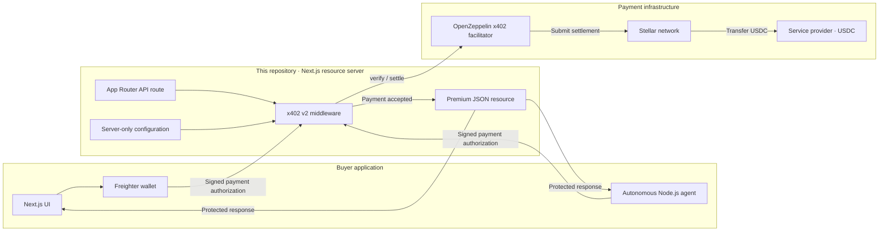
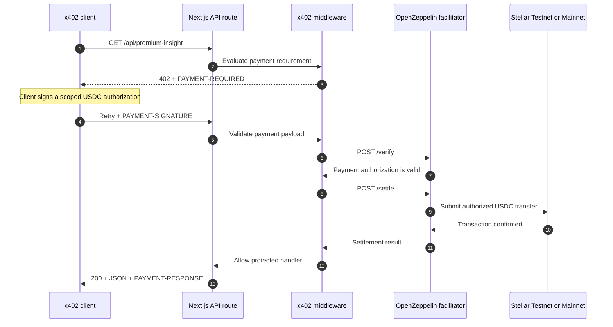
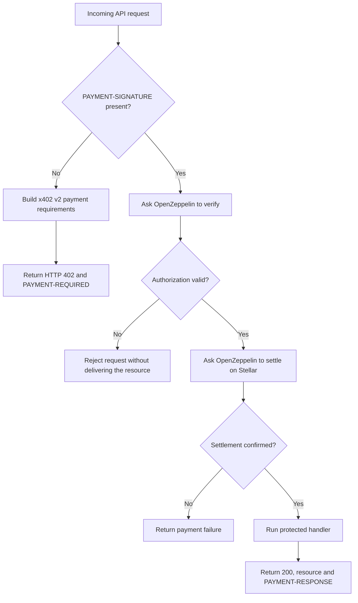

# Stellar x402 Workshop Server

A clone-friendly paid API built with Next.js App Router, TypeScript, x402 v2,
Stellar USDC, and the OpenZeppelin hosted facilitator.

## Solution architecture

This repository is the **resource server**. It publishes the paid API, defines
the price and recipient, and delegates payment verification and settlement to
the OpenZeppelin facilitator. The buyer lives in the separate workshop client
repository.



The API key used to call OpenZeppelin stays inside the resource server. The
server never receives the buyer's private key; it receives only a scoped,
signed authorization.

## Server request process



### Server responsibilities



## What students build

`GET /api/premium-insight` costs **$0.001 USDC**. Without payment it returns
`402 Payment Required`; an x402 client signs a scoped Stellar authorization and
retries; OpenZeppelin verifies and settles it; the server returns the JSON.

## Requirements

- Node.js 22 or newer
- A public Stellar Testnet address (`G...`) that can receive USDC
- An OpenZeppelin Testnet facilitator API key
- The separate workshop client for the complete payment test

## Install Stellar CLI

Install the latest stable release. The official installation guide is
https://developers.stellar.org/docs/tools/cli/install-cli.

### macOS

With Homebrew:

```bash
brew install stellar-cli
```

If it is already installed, update it:

```bash
brew update
brew upgrade stellar-cli
```

Alternative official installer when Homebrew is unavailable:

```bash
curl -fsSL https://github.com/stellar/stellar-cli/raw/main/install.sh | sh
```

Open a new terminal if the installer changes `PATH`, then verify:

```bash
stellar --version
```

### Windows

Open PowerShell and install with Windows Package Manager:

```powershell
winget install --id Stellar.StellarCLI
```

If it is already installed, update it:

```powershell
winget upgrade --id Stellar.StellarCLI
```

Close and reopen PowerShell, then verify:

```powershell
stellar --version
```

If `winget` is unavailable, install a signed Windows binary from the official
releases page: https://github.com/stellar/stellar-cli/releases. Add the folder
containing `stellar.exe` to the user `PATH` and reopen PowerShell.

The commands below target current Stellar CLI 26+. Versions 23–25 used the
legacy `--global` option. Upgrade the CLI instead of adding that removed flag.

## Create and fund the Testnet wallets

The complete demo uses two different accounts:

- `workshop-receiver` receives USDC and becomes the server's `PAY_TO`.
- `workshop-payer` holds USDC and signs through Freighter or the Node.js agent.

Confirm the tools first:

```bash
node --version
npm --version
stellar --version
```

Create both accounts, store them in the operating system's secure store and fund
them with Testnet XLM through Friendbot:

```text
stellar keys generate workshop-receiver --network testnet --fund --secure-store
stellar keys generate workshop-payer --network testnet --fund --secure-store
```

Print their public addresses:

```bash
stellar keys address workshop-receiver
stellar keys address workshop-payer
```

Both results must begin with `G`. If an account needs Testnet XLM again:

```bash
stellar keys fund workshop-receiver --network testnet
stellar keys fund workshop-payer --network testnet
```

Friendbot provides Testnet XLM, not USDC. Both accounts must establish the
official Testnet USDC trustline:

```text
stellar tx new change-trust --network testnet --source-account workshop-receiver --line USDC:GBBD47IF6LWK7P7MDEVSCWR7DPUWV3NY3DTQEVFL4NAT4AQH3ZLLFLA5 --limit 1000000
stellar tx new change-trust --network testnet --source-account workshop-payer --line USDC:GBBD47IF6LWK7P7MDEVSCWR7DPUWV3NY3DTQEVFL4NAT4AQH3ZLLFLA5 --limit 1000000
```

These single-line commands work unchanged in macOS terminals and Windows
PowerShell.

Request Testnet USDC for the public `G...` address of `workshop-payer` at
https://faucet.circle.com. The receiver needs the trustline but does not require
an initial USDC balance.

For the visual flow, import the payer into the Freighter browser extension and
select **Testnet**. Retrieve its secret only for this local import:

```bash
stellar keys secret workshop-payer
```

This prints an `S...` secret. Never paste it into this server, a README, chat,
screenshots or Git. Clear the terminal after importing it. Freighter Mobile does
not support this workshop flow; use the browser extension.

## Generate the OpenZeppelin Testnet key

Generate the facilitator credential at
https://channels.openzeppelin.com/testnet/gen. Store it only in `.env.local` as
`OPENZEPPELIN_API_KEY`. Never use a `NEXT_PUBLIC_` prefix.

## Quickstart on Testnet

Install the exact dependency versions and create a local environment file:

```bash
npm ci
npm run setup
```

`npm run setup` creates `.env.local` only when it does not exist. It never
overwrites an existing file.

Generate a Testnet key at https://channels.openzeppelin.com/testnet/gen and edit
`.env.local`:

```dotenv
STELLAR_NETWORK=stellar:testnet
FACILITATOR_URL=https://channels.openzeppelin.com/x402/testnet
USDC_CONTRACT=CBIELTK6YBZJU5UP2WWQEUCYKLPU6AUNZ2BQ4WWFEIE3USCIHMXQDAMA
PAY_TO=G_YOUR_TESTNET_RECEIVER
OPENZEPPELIN_API_KEY=your_testnet_key
CLIENT_ORIGIN=http://localhost:3001
```

`PAY_TO` is a public receiving address, never a secret seed. The receiving
account must support Testnet USDC. Keep the API key only in `.env.local`; this
file is ignored by Git.

Validate configuration and code before starting the API:

```bash
npm run preflight
npm run check
npm run dev
```

The server starts at http://localhost:3000. Keep this terminal running. The
separate client uses http://localhost:3001. When the exercise ends, return to
this terminal and press `Ctrl+C`; wait for the shell prompt before closing it.

## Test the paywall

In a second terminal, run the reproducible check:

```bash
npm run test:paywall
```

Expected fields include:

```json
{
  "status": 402,
  "x402Version": 2,
  "network": "stellar:testnet",
  "amount": "10000",
  "feesSponsored": true,
  "corsExposesPaymentHeaders": true
}
```

For the raw HTTP response:

```bash
curl -i http://localhost:3000/api/premium-insight
```

Expected: status `402` and a `PAYMENT-REQUIRED` response header. A `402` is the
correct result before the client supplies a signed payment authorization.

## Complete payment test

Run the applications in this order:

1. Create/fund the wallets and configure USDC trustlines.
2. Put the receiver's public `G...` address in server `PAY_TO`.
3. Generate and configure the OpenZeppelin Testnet API key.
4. Run server `npm run preflight`, `npm run check`, then `npm run dev`.
5. In another terminal, run server `npm run test:paywall` and confirm `402`.
6. Start the separate client on port `3001` using its README.
7. Connect the funded payer in Freighter on Testnet.
8. Inspect the initial `402`.
9. Authorize `0.001 USDC`.
10. Confirm `200`, the protected JSON and `PAYMENT-RESPONSE`.

If the browser cannot read the payment header, confirm `CLIENT_ORIGIN` exactly
matches the client URL and restart the server after changing `.env.local`.

## Command reference

| Command | Purpose |
| --- | --- |
| `npm run setup` | Create `.env.local` without overwriting an existing file |
| `npm run preflight` | Validate required Testnet configuration without printing secrets |
| `npm run dev` | Run the server on port 3000 |
| `npm run test:paywall` | Assert the unpaid request returns a valid x402 v2 `402` |
| `npm run check` | Run lint, unit tests and production build |

## Troubleshooting

- `PAY_TO must be a valid public Stellar G-address`: replace the placeholder
  with the receiver's public `G...` address.
- `OPENZEPPELIN_API_KEY is required`: generate and add the Testnet key, then
  restart the server.
- `Expected 402`: verify the server is running and `API_URL` has not been
  changed to another service.
- `EADDRINUSE` on port `3000`: another server is already running. Find it with
  `lsof -nP -iTCP:3000 -sTCP:LISTEN`, return to its terminal, and stop it with
  `Ctrl+C`. Do not start a second copy.
- Browser CORS error: keep `CLIENT_ORIGIN=http://localhost:3001` locally.
- Never commit `.env.local` or expose the API key using a `NEXT_PUBLIC_*` name.

## Mainnet configuration

The code supports Mainnet, but the workshop intentionally executes payments on
Testnet. For Mainnet, generate a key at https://channels.openzeppelin.com/gen
and switch these values together:

```dotenv
STELLAR_NETWORK=stellar:pubnet
FACILITATOR_URL=https://channels.openzeppelin.com/x402
USDC_CONTRACT=CCW67TSZV3SSS2HXMBQ5JFGCKJNXKZM7UQUWUZPUTHXSTZLEO7SJMI75
PAY_TO=G_YOUR_MAINNET_RECEIVER
OPENZEPPELIN_API_KEY=your_mainnet_key
```

Never reuse Testnet keys or addresses blindly on Mainnet. Never expose the API
key through a `NEXT_PUBLIC_` variable.

## Vercel

Import this repository in Vercel and configure the same server-side variables.
Set `CLIENT_ORIGIN` to the deployed client URL. No custom server is required.

## Official references

- https://developers.stellar.org/docs/build/agentic-payments/x402
- https://developers.stellar.org/docs/build/agentic-payments/x402/built-on-stellar
- https://docs.openzeppelin.com/relayer/guides/stellar-x402-facilitator-guide
- https://docs.x402.org/core-concepts/http-402
